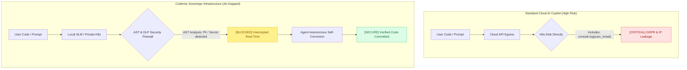

# Codernic - Air-Gapped Sovereign AI Infrastructure

> [!IMPORTANT]
> **[ ARCHITECTURE & OPEN-SOURCE NOTICE ]**
> 
> This repository contains the open-source client layer of the Codernic platform:
> 
> - **[OPEN-SOURCE] UI & Frontend**: Codernic Workspace (TypeScript/React)  
> - **[OPEN-SOURCE] VS Code Extension**: Full IDE integration layer  
> - **[OPEN-SOURCE] Protocol Crates**: Public API contracts and MCP bridges  
> 
> The proprietary core infrastructure is closed-source for IP, security, and commercial licensing reasons, delivering the 5 core pillars of enterprise governance (EMGOS):
> 
> - **[COMMERCIAL] Execution**: Native SLM inference runtime (Rust/Vulkan) with continuous batching  
> - **[COMMERCIAL] Memory**: Semantic context retrieval, PDF/Notion/Confluence ingestion & deduplication  
> - **[COMMERCIAL] Governance**: Automated SAST AST Pull Request review engine & Ed25519 WORM audit logging  
> - **[COMMERCIAL] Optimization**: Token economy, INT8 KV Cache & low-latency execution  
> - **[COMMERCIAL] Security**: Real-time AST Firewall, ONNX PII detection, and quality gate enforcement  
> 
> For enterprise licensing, Air-Gapped Pilot Program (Proof of Value), or partnership inquiries: [Contact us](https://codernic.dev/contact) | [LinkedIn](https://www.linkedin.com/company/codernic-dev/)



---

## The 5 Canonical Pillars of Enterprise Sovereign AI (EMGOS)

Codernic is engineered for institutions - banks, financial entities, healthcare providers, and defense organizations - that cannot compromise on data sovereignty or code security.

- **Execution:** Low-latency local SLM inference runtime running on bare-metal or private clusters for 100% air-gapped, zero-telemetry execution.
- **Memory:** Surgical semantic retrieval and context ingestion for massive repositories, technical documentation, PDFs, Notion, and Confluence spaces.
- **Governance:** Automated SAST AST Pull Request reviews with Ed25519-signed immutable audit trails for SOC 2, DORA, and NIS2 compliance.
- **Optimization:** Intelligent token economy and GPU KV-cache management to maximize local throughput while suppressing context bloat.
- **Security:** Real-time Abstract Syntax Tree (AST) interception mathematically blocks vulnerabilities, hardcoded secrets, ReDoS threats, and GDPR PII leaks before code touches disk.

---

## Air-Gapped Pilot Program (Enterprise Proof of Value)

We invite enterprise engineering & security leaders to evaluate Codernic directly within their private infrastructure under a bi-directional NDA:

- 100% Data Sovereignty: Zero cloud telemetry, zero external network calls. Deployed via K8s Distroless containers or local native runtimes.
- Real-Time AST Quality Gates: Intercepts and blocks GDPR violations, hardcoded secrets, ReDoS vulnerabilities, and supply-chain attacks before code reaches disk.
- WORM Audit Trails: Immutable logs signed with Ed25519 cryptography for SOC 2 & NIS2 compliance.

[Apply for the Enterprise Pilot Program](https://codernic.dev/contact)

---

## Reproducible Benchmarks (Single Source of Truth)

We believe engineering leaders shouldn't rely on static vendor marketing claims or "vibe coding". Performance and accuracy must be verifiable on your own hardware under your own security constraints.

Our benchmark methodology has evolved from unit-level throughput tests to full-stack, end-to-end Enterprise Governance Benchmarks.

- Run Local Benchmarks: Use the `codernic benchmark` CLI tool to execute reproducible performance tests directly on your cluster.
- Live Benchmark Results: View our transparent, methodology-documented benchmark data: [codernic.dev/benchmarks](https://codernic.dev/benchmarks)

---

## CLI Commands & Interface

The `codernic` CLI provides direct access to the sovereign engine:

| Command | Description |
|---|---|
| `codernic ask "query"` | Direct query to the local LLM (Unitary inference with RAG option) |
| `codernic chat` | Interactive stateful session with intent routing |
| `codernic agent --run <dag.json>` | Execute a DAG agent configuration for supervised execution |
| `codernic analyze --path .` | Audit a repository or file against AST Security Rules |
| `codernic code:index --path .` | Trigger semantic indexing of a codebase (RAG Engine) |
| `codernic benchmark` | Run reproducible local performance & DLP benchmark suite |
| `codernic vault` | Manage the Codernic Encrypted Vault (API Keys & Secrets) |

---

## Build from Source (Public Client Layers)

> **Note:** Building from source applies to the open-source client layers. Proprietary core engines are bundled as native pre-compiled binaries in the VSIX and Enterprise packages.

```bash
# Clone the repository
git clone https://github.com/Codernic-dev/codernic.dev.git
cd codernic.dev

# Run automated multi-platform build script
chmod +x build.sh
./build.sh
```

---

## License

- VS Code Extension: MIT
- Codernic UI: AGPLv3
- Proprietary Engines: Commercial License

Copyright (c) 2024-2026 Codernic Team. All rights reserved.
