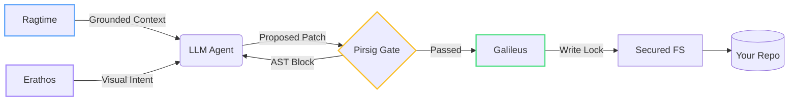

# Codernic — The AI that codes under supervision.

> Not another coding assistant. A supervised engineering runtime.

The problem with every other AI coding tool is that they are *confidently wrong*. When you apply a probabilistic tool (an LLM) to a deterministic domain (software engineering), the result is hallucinated imports, architectural drift, and technical debt generated at machine speed. 

Codernic is different. It is a **supervised engineering runtime** built in Rust. It does not trust the LLM. Every line of code generated by Codernic is evaluated by deterministic quality gates, and every file write is arbitrated by an actor system to prevent multi-agent collisions.

* **449 files indexed in 1.03s** (hybrid FTS5 + vector search)
* **10 parallel agents, zero file conflicts** (mathematically guaranteed)
* **0 hallucinated imports** (blocked by AST parsing before hitting disk)
* **100% Local-First** (AMD ROCm, NVIDIA CUDA, Apple Metal, or CPU)

---

## The Supervision Stack

Codernic wraps the LLM in a rigid, deterministic pipeline. 



### 📚 Ragtime (Semantic Context Engine)
Dumping 200K tokens into an LLM context window is intellectually lazy and computationally disastrous. Ragtime is Codernic's codebase memory system. It crawls your project, computes Blake3 hashes for incremental re-indexing, extracts symbols via Tree-sitter, and builds a hybrid retrieval index combining FTS5 full-text search with BERT embedding vectors. It loads only the 2-5 files relevant to a task. Fewer tokens = smarter answers.

### 📐 Erathos (Visual Grounding Layer)
Language is ambiguous. Architecture diagrams are not. Erathos allows developers to provide context to the agent in the form of UML class diagrams, architecture patterns, or data flows. Codernic uses this structured visual context to understand intent before generating code, closing the intent gap.

### ⚖️ Pirsig (Quality Gate Engine)
Pirsig enforces quality as a first-class invariant. When the LLM generates a patch, Pirsig parses the AST (Abstract Syntax Tree) using Tree-sitter. It checks for hallucinated imports and project convention violations. If it finds a structural violation, it issues a "black" severity flag and the code is rejected. **Bad code never reaches disk.**

### 🛡️ Galileus (Conflict Arbitration)
When running parallel agents (e.g., a backend agent and a documentation agent), file conflicts are inevitable. Galileus is a Tokio actor that acts as the single source of truth for file access. Before an agent writes to a file, it must declare an intent (Read, Write, Exclusive). Galileus queues conflicting agents atomically, making parallel execution mathematically conflict-free.

### 🔒 Secured FS
Hardcoded forbidden paths. The engine physically cannot write to protected configuration or credential files regardless of LLM instructions.

---

## How this differs from the market

The current market pushes developers to abandon their tools for full-IDE forks (Cursor/Zed) or rely on cloud agents that hallucinate blindly in sandboxes (Devin/Claude Code). 

Codernic is a headless orchestrator that brings deterministic AI into *your* editor.

| Feature | Codernic | Devin (Cloud Agents) | Cursor / Zed | GitHub Copilot |
|---|---|---|---|---|
| **Paradigm** | **Supervised Runtime** | Autonomous Cloud | IDE Fork | Inline Autocomplete |
| **AST Quality Gates**| **Yes (Pirsig Engine)** | Post-run tests | None (LSP Post-disk)| None |
| **Concurrency** | **Galileus (Actor Locks)**| Single Agent | None (Manual conflicts) | N/A |
| **Visual Grounding**| **Erathos (UML/DAGs)** | No | No | No |
| **Privacy / Execution** | **100% Local / GGUF** | Cloud | Cloud | Cloud |

*(For a detailed breakdown, see `documentation/competitor_matrix.md`)*

---

## 🗺️ Roadmap (V2 Upcoming)

While V1 strictly focuses on deterministic, offline codebase editing, our V2 roadmap expands Codernic's capabilities safely:
- **Hybrid Search Context**: Upgrading Ragtime to combine BM25 exact-keyword lexical search with mathematical Vector embeddings.
- **The Adversarial Web Scraper**: An isolated "Hermetic SAS" subagent that fetches external framework docs from the internet, which the strict offline deterministic engine evaluates before applying.
- **MCP Hub**: A secure plugin ecosystem for connecting tools like Jira, AWS, and Stripe via the Model Context Protocol.

---

### Installation

**From VSIX (Zero-Friction Local Deployment)**:
Download the latest VSIX package from the Releases page. The payload is pre-bundled with all native Rust compiled binaries. 

```bash
code --install-extension codernic-ext-0.6.342.vsix --force
```

### Build from Source (Engine Developers)

```bash
# Clone the repository
git clone https://github.com/binaryjack/codernic.dev.git
cd codernic.dev

# Run the automated multi-platform build script
chmod +x build.sh
./build.sh
```

## CLI Commands

The `agencee` CLI provides direct access to the engine:

| Command | Description |
|---|---|
| `agencee agent --run <dag.json>` | Execute a DAG agent plan |
| `agencee code:index --path .` | Index the codebase (Ragtime) for semantic search |
| `agencee daemon start` | Start the background inference daemon |
| `agencee daemon stop` | Stop the background daemon |

---

## Ecosystem

- **Codernic UI**: Web-based dashboard for visualizing live DAG execution and agent states (powered by Erathos).
- **VS Code Extension**: Full IDE integration with real-time streaming feedback over MCP.
- **MCP Integration**: Expose internal tools and context via the Model Context Protocol.

For full documentation, advanced guides, and our philosophy, visit **[codernic.dev](https://codernic.dev)**.

## License

MIT — Copyright (c) 2024-2026 Codernic Team.
