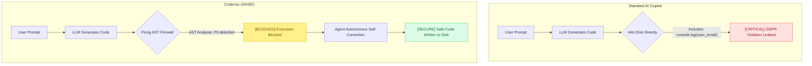

# Codernic - The World's First SASEI

> [!IMPORTANT]
> **[ ARCHITECTURE NOTICE ]**
> 
> This repository contains the open-source client layer of the Codernic platform:
> 
> - **[OPEN-SOURCE] UI & Frontend**: Codernic Workspace (TypeScript/React)  
> - **[OPEN-SOURCE] VS Code Extension**: Full IDE integration layer  
> - **[OPEN-SOURCE] Protocol Crates**: Public API contracts and MCP bridges  
> 
> The following components are proprietary and closed-source for IP and commercial licensing reasons:
> 
> - **[COMMERCIAL] Deming Engine**: Custom LLM inference runtime (Rust/Vulkan) with Paged Attention, Medusa Speculative Decoding, DoRA on-device training, and 39 hand-written GLSL compute shaders  
> - **[COMMERCIAL] Pirsig Engine**: Real-time AST Firewall and quality gate enforcement  
> - **[COMMERCIAL] Ragtime Engine**: Semantic context retrieval and deduplication  
> - **[COMMERCIAL] Galileus DAW**: Multi-agent orchestration runtime  
> 
> For enterprise licensing, partnership, or co-founder inquiries: [Contact us](https://codernic.dev/contact) | [LinkedIn](https://www.linkedin.com/company/codernic-dev/)

> **Secure Autonomous Software Engineering Infrastructure.** We don't just generate code. We enforce deterministic architecture, block vulnerabilities via AST Firewalls, and guarantee absolute data sovereignty on bare-metal. The era of Copilots is over.



## We are looking for Investors & Beta Testers

We are currently scaling our operations and entering our private beta phase.
- **Investors:** If you are interested in backing the future of deterministic, air-gapped AI software engineering, let's talk.
- **Enterprises / Teams:** Want to 10x your engineering velocity with absolute safety and IP sovereignty? Join our private beta.

**[CONTACT]** [Contact Form](https://codernic.dev/contact) | **[LINKEDIN]** [Codernic Dev](https://www.linkedin.com/company/codernic-dev/)

---

## Demonstrated Engineering & Benchmarks

Codernic's superiority is built on measurable, deterministic engineering. We don't rely on "vibe coding" or raw probabilistic generation. Instead, we enforce strict bounds on the LLM to guarantee predictable, enterprise-ready output.

### The Deming Engine (Execution Speed & Multi-Tenancy)
Built in pure Rust and Vulkan, our local execution engine is engineered for maximum throughput while enforcing strict architectural constraints:
- **Multi-Tenant Scalability:** Continuous batching router successfully handles 100+ concurrent async tasks. Supports up to **~64 simultaneous running sequences** (Batch=32) without VRAM saturation.
- **INT8 KV Cache Optimization:** Reduces VRAM footprint by 50% (~128 KB per layer/1k tokens), yielding a **+88% capacity boost** for concurrent sequences over standard F16 caching.
- **4,200+ TPS (Total Throughput):** Achieved during multi-tenant stress tests (Batch=32) on consumer hardware (RTX 4090 / RX 7900 XTX) with an ultra-low Average TTFT (Time To First Token) of **~145ms**.
- **270+ TPS (Single Sequence):** Maximum burst throughput achieved via Medusa Speculative Decoding.
- **22.91 TPS (Constrained):** Sustained throughput on local models (`Qwen2.5-Coder-1.5B` & `Llama-3.1-8B`) while continuously evaluating AST quality gates in real-time.

### Pirsig Quality Gates (Zero Hallucinated Code)
Language models hallucinate. Pirsig ensures those hallucinations never reach your disk. Using near-instant AST interception (Time To First Token), Pirsig actively blocks:
- **Unmasked PII Leaks (GDPR):** Intercepts and scrubs sensitive logging attempts (e.g., `console.log(email)` or raw PAN exposures in Go).
- **Supply Chain Attacks (Anti-Slopsquatting):** Prevents insertion of undocumented dependencies into package files.
- **Monolithic "God Components":** Enforces Feature-Sliced Design (FSD) by dynamically blocking single-file dumps exceeding strict line limits.
- **Unsafe Rust / HFT Constraints:** Preemptively blocks `.unwrap()`, `unsafe` blocks in Rust, or standard locking primitives (`std::mutex`) in lock-free C++ High-Frequency Trading code.
- **ReDoS Vulnerabilities:** Detects and blocks catastrophic backtracking regex generation.

### Ragtime Context Engine (Semantic Efficiency)
Dumping 200,000 tokens into a cloud LLM context window is computationally disastrous, highly expensive, and ecologically irresponsible. 
Codernic uses Ragtime, a semantic retrieval system that mathematically limits context size to surgical precision:
- **Chunk Truncation:** Dynamically limits the context of massive state managers (e.g., 5,000-line Redux files) to 50 lines per relevant semantic chunk.
- **Rate-Limit Economy:** Pre-evaluates prompts. Broad requests (e.g., "Refactor everything") on 200k+ LOC repositories are blocked instantly, preventing 1M token context bloat and forcing targeted, cost-effective engineering.

---

## Enterprise & Advanced Capabilities (Included)

Beyond deterministic code generation, the Codernic platform includes advanced systems designed for massive codebases and enterprise workflows:
- **Hybrid Context Retrieval**: Ragtime already combines exact-keyword lexical search with mathematical Vector embeddings to navigate millions of lines of code.
- **Hermetic Context Expansion**: An isolated fetching system (`HermeticScraper`) that retrieves external framework documentation safely, natively passing all ingested data through Pirsig DLP scans before it reaches the agent.
- **MCP Plugin Ecosystem**: Native Model Context Protocol (MCP) integration, allowing sovereign enterprise teams to securely connect internal tools (Jira, AWS, custom internal APIs) directly into the agent's DAG.

---

### Installation

**From VSIX (Zero-Friction Local Deployment)**:
Download the latest VSIX package from the Releases page. The payload is pre-bundled with all native Rust compiled binaries. 

```bash
code --install-extension codernic-ext-0.6.477.vsix --force
```

### B2B Enterprise Deployments (Sovereign R&D Governance)

For Enterprise and B2B deployments, strict AI behavior constraints must be enforced. To guarantee zero IP leakage and deterministic code generation, Codernic utilizes a centralized Quality Gate and Semantic deduplication flow entirely offline. Contact us to learn how to deploy Codernic across your sovereign engineering teams safely.

### Build from Source (Frontend / Extension Developers)

> **Note:** The Deming, Pirsig, Ragtime, and Galileus engines are proprietary and distributed as pre-compiled binaries included in the VSIX package. Building from source applies to the open-source client layers.

```bash
# Clone the repository
git clone https://github.com/binaryjack/codernic.dev.git
cd codernic.dev

# Run the automated multi-platform build script
chmod +x build.sh
./build.sh
```

## CLI Commands

The `codernic` CLI provides direct access to the engine:

| Command | Description |
|---|---|
| `codernic ask "query"` | Direct query to the LLM (Unitary inference with RAG option) |
| `codernic chat` | Interactive session (Stateful) with intent routing |
| `codernic agent --run <dag.json>` | Execute a DAG agent configuration for supervised execution |
| `codernic analyze --path .` | Analyze a project (tech stack) or audit a specific file (Pirsig Engine) |
| `codernic code:index --path .` | Trigger a complete semantic index of a repository (Ragtime) |
| `codernic daemon start` | Start the background inference daemon |
| `codernic huggingface-download <model>`| Download a model from HuggingFace and configure the local provider |
| `codernic vault` | Manage the Codernic Secret Vault (API Keys) |

---

## Ecosystem

- **Codernic UI**: Web-based dashboard for visualizing live DAG execution and agent states (powered by Erathos).
- **VS Code Extension**: Full IDE integration with real-time streaming feedback over MCP.
- **MCP Integration**: Expose internal tools and context via the Model Context Protocol.

For full documentation, advanced guides, and our philosophy, visit **[codernic.dev](https://codernic.dev)**.

## License

**VS Code Extension**: MIT
**Codernic UI**: AGPLv3
**Proprietary Engines** (Deming, Pirsig, Ragtime, Galileus): Commercial License

Copyright (c) 2024-2026 Codernic Team.
